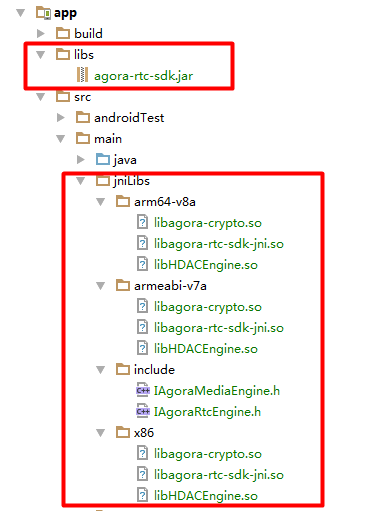
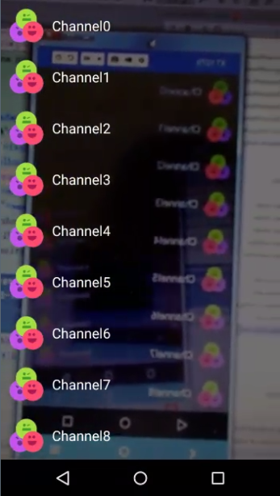

叔想做个直播demo很久了，最近终于得空，做了一个视频群聊Demo，以飨观众。 直播云有很多大厂在做，经老铁介绍，Agora不错，遂入坑。 Agora提供多种模式，一个频道可以设置一种模式, 切换方便：


# Agora SDK集成 #
叔专注SDK集成几十年，Agora SDK集成也并没有搞什么事情，大家按照下面步骤上车就行。

## 1. 注册 ##
登录[官网](https://www.agora.io/cn/)，注册个人账号，这个叔就不介绍了。

## 2. 创建应用 ##
注册账号登录后，进入后台，找到“添加新项目”按钮，点击创建新项目，创建好后就会获取到一个App ID, 做过SDK集成的老铁们都知道这是干啥用的。


## 3. 下载SDK ##
进入官方[下载](https://www.agora.io/cn/news/download/)界面, 这里我们选择```视频通话 + 直播 SDK```中的Android版本下载。下载后解压之后又两个文件夹，分别是libs和samples, libs文件夹存放的是库文件，samples是官方Demo源码，大叔曾说过欲练此SDK，必先跑Sample, 有兴趣的同学可以跑跑。

## 4. 集成SDK ##
### 1. 导入库文件 ###
将libs文件夹的下的文件导入Android Studio, 最终效果如下：



### 2. 添加必要权限 ###
在AndroidManifest.xml中添加如下权限

    <uses-permission android:name="android.permission.INTERNET" />
    <uses-permission android:name="android.permission.RECORD_AUDIO" />
    <uses-permission android:name="android.permission.ACCESS_NETWORK_STATE" />
    <uses-permission android:name="android.permission.CAMERA" />

### 3. 配置APP ID ###
在values文件夹下创建strings-config.xml, 配置在官网创建应用的App ID。

	<resources>
	    <string name="private_app_id">6ffa586315ed49e6a8cdff064ad8a0b0</string>
	</resources>

# 小结 #
至此，Agoria SDK集成已经完毕，似不似如丝般顺滑？如果官方能够提供Gradle依赖，还可以省掉下载SDK和导入库文件的步骤，那就更滑了。接下来我们就可以愉快地和SDK玩耍了。

# Agoria SDK实践 #
## 主界面 ##


在主界面，我们需要检查先Camera和Audio权限，以适配Andriod6.0及以上版本。

    private static final int PERMISSION_REQ_ID_RECORD_AUDIO = 0;
    private static final int PERMISSION_REQ_ID_CAMERA = 1;

    @Override
    protected void onCreate(Bundle savedInstanceState) {
        super.onCreate(savedInstanceState);
        setContentView(R.layout.activity_main);
		//检查Audio权限
        if (checkSelfPermission(Manifest.permission.RECORD_AUDIO, PERMISSION_REQ_ID_RECORD_AUDIO)) {
			//检查Camera权限
            checkSelfPermission(Manifest.permission.CAMERA, PERMISSION_REQ_ID_CAMERA);
        }
    }

    public boolean checkSelfPermission(String permission, int requestCode) {
        if (ContextCompat.checkSelfPermission(this, permission) != PackageManager.PERMISSION_GRANTED) {
            ActivityCompat.requestPermissions(this, new String[]{permission}, requestCode);
            return false;
        }
        return true;
    }

## 频道界面 ##
点击```开PA!```，进入频道选择界面



### 创建频道列表 ###
这里使用RecyclerView创建频道列表。

    /**
     * 初始化频道列表
     */
    private void initRecyclerView() {
        mRecyclerView = (RecyclerView) findViewById(R.id.recycler_view);
        mRecyclerView.setHasFixedSize(true);
        mRecyclerView.setLayoutManager(new LinearLayoutManager(this));
        mRecyclerView.setAdapter(new ChannelAdapter(this, mockChannelList()));
    }

### 前置摄像头预览 ##
频道界面背景为前置摄像头预览，这个可以使用Android SDK自己实现。但Agora SDK提供了相关API可以直接实现前置摄像头预览的功能。具体实现如下：

#### 1. 初始化RtcEngine ####
RtcEngine是Agora SDK的核心类，叔用一个管理类AgoraManager进行了简单的封装，提供操作RtcEngine的核心功能。
初始化如下：

    /**
     * 初始化RtcEngine
     */
    public void init(Context context) {
        //创建RtcEngine对象
        mRtcEngine = RtcEngine.create(context, context.getString(R.string.private_app_id), mRtcEventHandler);
        //开启视频功能
        mRtcEngine.enableVideo();
        //视频配置，设置为360P
        mRtcEngine.setVideoProfile(Constants.VIDEO_PROFILE_360P, false);
        mRtcEngine.setChannelProfile(Constants.CHANNEL_PROFILE_COMMUNICATION);//设置为通信模式（默认）
        //mRtcEngine.setChannelProfile(Constants.CHANNEL_PROFILE_LIVE_BROADCASTING);设置为直播模式
        //mRtcEngine.setChannelProfile(Constants.CHANNEL_PROFILE_GAME);设置为游戏模式
    }


	/**
	 * 在Application类中初始化RtcEngine，注意在AndroidManifest.xml中配置下Application
	 */
	public class LaoTieApplication extends Application {
	
	    @Override
	    public void onCreate() {
	        super.onCreate();
	        AgoraManager.getInstance().init(getApplicationContext());
	    }
	}

#### 2. 设置本地视频 ####

    /**
     * 设置本地视频，即前置摄像头预览
     */
    public AgoraManager setupLocalVideo(Context context) {
        //创建一个SurfaceView用作视频预览
        SurfaceView surfaceView = RtcEngine.CreateRendererView(context);
        //将SurfaceView保存起来在SparseArray中，后续会将其加入界面。key为视频的用户id，这里是本地视频, 默认id是0
        mSurfaceViews.put(mLocalUid, surfaceView);
        //设置本地视频，渲染模式选择VideoCanvas.RENDER_MODE_HIDDEN，如果选其他模式会出现视频不会填充满整个SurfaceView的情况，
        //具体渲染模式的区别是什么，官方也没有详细的说明
        mRtcEngine.setupLocalVideo(new VideoCanvas(surfaceView, VideoCanvas.RENDER_MODE_HIDDEN, mLocalUid));
        return this;//返回AgoraManager以作链式调用
    }

#### 3. 添加SurfaceView到布局 ####